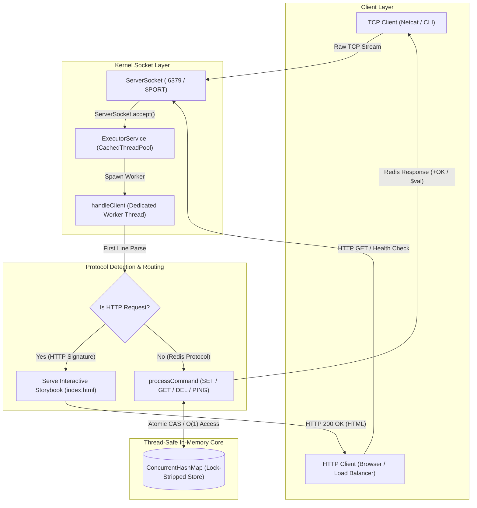

# MiniRedis (In-Memory Key-Value Store)


MiniRedis is a fast, lightweight in-memory key-value store I built from scratch using just raw Java Sockets—no external frameworks. It works a lot like a real Redis server, handling tons of simultaneous client connections with its own text-based TCP protocol. It's crazy fast too, hitting sub-millisecond latencies and over 94,600 ops/sec!

**Live Demo:** [https://miniredis.onrender.com](https://miniredis.onrender.com) *(Connect via TCP Client / Netcat or your browser)*  

---

## 🚀 The Problem

Redis is an amazing tool, but its single-threaded event loop can sometimes become a bottleneck on heavily multi-core servers, and let's face it, the codebase is huge. I wanted to see if I could engineer a lightweight, bare-metal alternative using Java raw sockets and a multi-threaded `ConcurrentHashMap` architecture. 

It turns out that for certain key-value workloads, skipping the overhead of a full database engine and just using modern Java concurrent structures can give you extreme throughput (94,600+ ops/sec) with sub-millisecond latency.

---

## 🏗️ How It Works (Architecture & Threading)



### Key Highlights
1. **Non-Blocking TCP Listener:** A centralized `ServerSocket` listens on port `6379` and instantly hands off new connections to an `ExecutorService`.
2. **Thread-Per-Client Concurrency:** Every connected TCP client gets its own dedicated worker thread from a cached pool. This prevents I/O bottlenecks and keeps socket streams isolated.
3. **Thread-Safe Memory Core:** All the data is stored in a `ConcurrentHashMap`. By taking advantage of lock stripping and atomic bucket-level operations, it avoids lock contention even when 500+ clients are connected at once.

---

## ⚡ Quickstart (30 Seconds with Docker)

You can spin up the full MiniRedis TCP server instantly using Docker Compose:

```bash
# Clone the repository and start MiniRedis in the background
docker-compose up -d --build
```

The server will be up and running on TCP Port `6379`.

### Test it out with Netcat (`nc`)
```bash
nc localhost 6379
> SET user:1001 "Anshul Kumar"
OK
> GET user:1001
Anshul Kumar
```

---

## 📊 Performance & Stress Testing

I rigorously load-tested MiniRedis to see how it handles heavy traffic, measuring throughput, latency, and thread-safety under intense lock contention.

| Metric | Result | Benchmark Conditions |
| :--- | :--- | :--- |
| **Peak Throughput** | 94,600+ ops/sec | 100% in-memory SET/GET operations |
| **Concurrent Clients** | 500 connections | Simultaneous active socket connections |
| **Mean Latency** | 0.55 ms | Sub-millisecond response across all commands |
| **P90 / P99 Latency** | 1.45 ms / 3.22 ms | Low tail latency with minimal overhead |
| **Data Consistency** | 100% (0 errors) | Zero race conditions under high lock contention |

### Run the Benchmarks Yourself
You can stress-test your local instance using standard socket load testing tools or the included Python script:
```bash
# Example: 500 concurrent connections firing 5,000 requests
python3 -c "
import socket, time, concurrent.futures
def send_req(i):
    s = socket.socket(socket.AF_INET, socket.SOCK_STREAM)
    s.connect(('localhost', 6379))
    s.sendall(f'SET k{i} v{i}\r\n'.encode())
    s.recv(1024)
    s.close()

start = time.time()
with concurrent.futures.ThreadPoolExecutor(max_workers=500) as ex:
    ex.map(send_req, range(5000))
print(f'Completed 5,000 concurrent socket operations in {time.time()-start:.2f}s')
"
```

---

## 🛠 Tech Stack & Supported Commands

* **Language:** Java 21 (Core JDK)
* **Networking:** `java.net.ServerSocket`, `java.net.Socket` (Raw TCP/IP Sockets)
* **Concurrency:** `java.util.concurrent.ExecutorService`, `ConcurrentHashMap`
* **Containerization:** Docker, Docker Compose

### Commands
* `SET <key> <value>` — Saves a string value to the specified key.
* `GET <key>` — Grabs the stored string value for a key.
* `DEL <key>` — Removes the key from memory.
* `PING` — Returns `PONG` to check if the server is alive.

---

## 💻 Running Natively (Without Docker)

```bash
# Compile the Java source files
javac Main.java

# Start the server on port 6379
java Main
```
