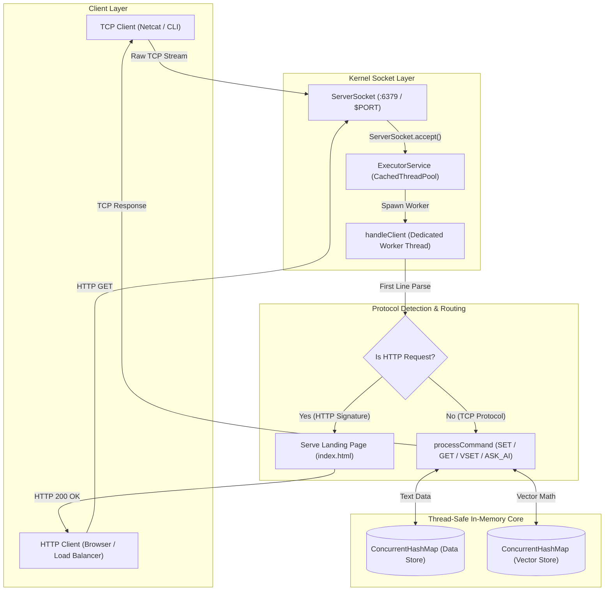

<div align="right">
  <a href="https://ai-integration-miniredis.vercel.app">Live Demo</a> | <a href="https://ai-miniredis.onrender.com">Backend API</a>
</div>

# MiniRedis (In-Memory Key-Value Store)


MiniRedis is a fast, lightweight in-memory key-value store built from scratch using raw Java Sockets. It operates without any external frameworks. It handles many simultaneous client connections using its own text-based TCP protocol. It delivers high performance, achieving sub-millisecond latencies and high operations per second.

Recently, MiniRedis was upgraded to include an AI-powered Vector Database and an Agentic Engine. This allows it to understand mathematical vectors, compute similarities, and intelligently cache AI prompts to save time and API costs.

---

## The Problem

Redis is a great tool, but its single-threaded event loop can become a bottleneck on multi-core servers. The codebase is also quite large. The goal was to build a lightweight, bare-metal alternative using Java raw sockets and a multi-threaded architecture. 

By using modern Java concurrent structures, this project achieves extreme throughput with sub-millisecond latency for standard key-value workloads.

To make it even better, AI applications need a way to store and search mathematical vectors. Instead of relying on heavy external vector databases, this capability was built directly into MiniRedis natively.

---

## How It Works (Architecture & Threading)



### Key Highlights
1. **Non-Blocking TCP Listener:** A centralized socket listens on port 6379 and hands off new connections to a thread pool.
2. **Thread-Per-Client Concurrency:** Every connected TCP client gets its own dedicated worker thread. This prevents bottlenecks and keeps socket streams isolated.
3. **Thread-Safe Memory Core:** Data and vectors are stored in concurrent maps. This avoids lock contention even when many clients are connected at once.
4. **Native AI Integration:** It communicates with the Google Gemini API using native Java HTTP clients without any bulky libraries.
5. **Agentic Semantic Cache:** It converts user questions into vector embeddings and checks for similar past questions. If a match is found with high similarity, it returns the cached answer instantly. Otherwise, it queries the AI and caches the new response.

---

## Quickstart (30 Seconds with Docker)

You can spin up the full MiniRedis TCP server using Docker Compose:

```bash
docker-compose up -d --build
```

The server will be up and running on TCP Port 6379. Make sure to set your Gemini API key in the environment to use the AI features.

### Test it out with Netcat (nc)
```bash
nc localhost 6379
> SET user:1001 "Anshul Kumar"
OK
> GET user:1001
Anshul Kumar
> ASK_AI What is the capital of France?
Paris.
> ASK_AI Tell me the capital city of France
Paris.
```
*(The second ASK_AI command returns instantly from the semantic cache!)*

---

## Tech Stack & Supported Commands

* **Language:** Java 21 (Core JDK)
* **Networking:** Raw TCP/IP Sockets
* **Concurrency:** ExecutorService, ConcurrentHashMap
* **AI:** Google Gemini API (via native java.net.http.HttpClient)

### Standard Commands
* `SET <key> <value>` — Saves a string value to the specified key.
* `GET <key>` — Grabs the stored string value for a key.
* `DEL <key>` — Removes the key from memory.
* `PING` — Returns PONG to check if the server is alive.

### AI and Vector Commands
* `VSET <key> <value1,value2...>` — Stores a mathematical vector (comma-separated floats).
* `VSIMILAR <value1,value2...> <top_k>` — Calculates cosine similarity and returns the closest matching keys.
* `ASK_AI <prompt>` — Asks a question. It will use the semantic cache first, and if not found, it will call the Gemini API and cache the result.

---

## Running Natively (Without Docker)

```bash
# Export your API key
export GEMINI_API_KEY="your-api-key"

# Compile the Java source files
javac Main.java GeminiClient.java

# Start the server on port 6379
java Main
```
